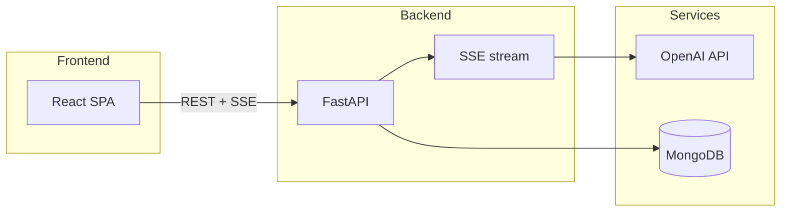

<div align="center">

# Inkstream

**AI chat platform** — a modern web client and OpenAI-backed API with streaming responses.

<p align="center">
  
</p>

[](https://fastapi.tiangolo.com/)
[](https://react.dev/)
[](https://www.typescriptlang.org/)
[](https://www.mongodb.com/)

</div>

---

## Table of contents

- [About](#about)
- [Features](#features)
- [Architecture](#architecture)
- [Requirements](#requirements)
- [Quick start](#quick-start)
- [Environment variables](#environment-variables)
- [API](#api)
- [Postman](#postman)

---

## About

**Inkstream** is a full-stack app for LLM conversations: threads, message history, and **streaming replies (SSE)** from OpenAI. The UI is built with React, focused on readability and Markdown rendering in messages.

---

## Features

| Area | Details |
|------|---------|
| **Chat** | Create conversations, send messages, stream tokens via Server-Sent Events |
| **UI** | React 19, Vite, Tailwind CSS 4, Geist typography, syntax highlighting in replies |
| **Backend** | FastAPI, service and repository layers, ObjectId validation on routes |
| **Security & resilience** | Configurable CORS, security headers, rate limiting (SlowAPI), handling for OpenAI errors and missing conversations |
| **Data** | MongoDB; sample collection dumps under `Database/` for local development |

---

## Architecture

```text
Inkstream/
├── Backend/          # FastAPI, OpenAI, MongoDB
├── Frontend/         # React + Vite + TypeScript
├── Database/         # Example JSON collection dumps
└── postman/          # Postman collection
```



---

## Requirements

- **Python** 3.11+ (this repo may use 3.14 artifacts; prefer a current stable release that matches your dependency support)
- **Node.js** 20+ (for Vite 8 and React 19)
- **MongoDB** (Atlas or a local instance)
- An **OpenAI** account with an API key

---

## Quick start

### 1. Backend virtual environment

```bash
cd Backend
python -m venv .venv
```

**Windows (PowerShell):**

```powershell
.\.venv\Scripts\Activate.ps1
pip install -r requirements.txt
copy .env.example .env
```

**macOS / Linux:**

```bash
source .venv/bin/activate
pip install -r requirements.txt
cp .env.example .env
```

Edit `.env` (see [Environment variables](#environment-variables)).

Run the API (default port **8000**):

```bash
uvicorn app.main:app --reload --host 0.0.0.0 --port 8000
```

Smoke test: open `http://localhost:8000/` in a browser — you should see a short JSON greeting.

### 2. Frontend

```bash
cd Frontend
npm install
npm start
```

The Vite dev server URL is printed in the terminal (often `http://localhost:5173`).

The client API base URL is set in `Frontend/src/config/AppConfig.ts` (`http://localhost:8000/api`). For production, update `BASE_URL` and align `CORS_ORIGINS` on the backend.

### 3. Production build

```bash
cd Frontend
npm run build
```

Static assets are emitted to `Frontend/dist/`.

---

## Environment variables

Configure `Backend/.env` (template: `Backend/.env.example`):

| Variable | Purpose |
|----------|---------|
| `OPENAI_API_KEY` | OpenAI API key |
| `OPENAI_MODEL` | Model id (for example `gpt-4o-mini`) |
| `MONGO_DB_URI` | MongoDB connection string |
| `MONGO_DB_NAME` | Database name |
| `CORS_ORIGINS` | Allowed origins, comma-separated (for example `http://localhost:5173`) |

---

## API

Prefix: **`/api`**

| Method | Path | Description |
|--------|------|---------------|
| `GET` | `/api/conversations` | List conversations |
| `POST` | `/api/conversations` | Create a conversation |
| `GET` | `/api/conversations/{id}` | Conversation details |
| `DELETE` | `/api/conversations/{id}` | Delete a conversation |
| `POST` | `/api/conversations/{id}/messages` | Send a message (**SSE** event stream) |

`{id}` is a 24-character hex **MongoDB ObjectId**.

Interactive FastAPI docs: `http://localhost:8000/docs` (Swagger UI).

---

## Postman

Collections for manual testing:

- `Backend/postman/Inkstream.postman_collection.json`
- Duplicate at repo root: `postman/Inkstream.postman_collection.json`

Import into Postman and configure environment variables (base URL; keep secrets out of shared collections per your security policy).

---

## Frontend scripts

| Command | Action |
|---------|--------|
| `npm start` | Development server (Vite) |
| `npm run build` | Production build |
| `npm run preview` | Preview the production build locally |
| `npm run lint` | ESLint |

---

<div align="center">

**Inkstream** — one stream for every AI conversation.

© 2026

</div>
